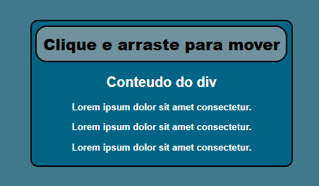

# How to Create Element HTML Draggable
#### **Como tornar um elemento HTML arrastavél usando JS**

Este repositório contém um exemplo prático de como tornar um elemento HTML arrastável. O código HTML e JavaScript fornecido permite que você clique e arraste um elemento na página.

#### Preview:

  

## Notas:
- Utiliza o cabeçalho do elemento como alça de arrasto.
- Você pode personalizar o estilo e comportamento do elemento arrastável ajustando as propriedades CSS e o HTML conforme necessário.
- Sinta-se à vontade para experimentar e adaptar o código para atender às suas necessidades.
- Este é um projeto de laboratório destinado a aprimorar minhas habilidades, portanto, pode não haver atualizações
- Sinta-se à vontade para usar este repositorio como quiser e contribuir com melhorias, abrindo issues ou pull requests.
- Este código é fornecido sob a licença MIT.